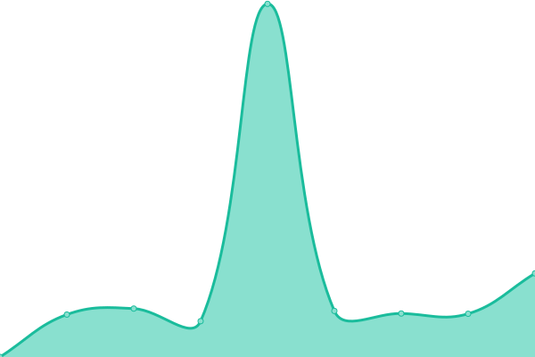

# [📈 Live Status](https://lz1gsp.github.io/m17-gsp): <!--live status--> **🟧 Partial outage**

This repository contains the open-source uptime monitor and status page for [GEORGE](https://lz1gsp.github.io/m17-gsp), powered by [Upptime](https://github.com/upptime/upptime).

With [Upptime](https://upptime.js.org), you can get your own unlimited and free uptime monitor and status page, powered entirely by a GitHub repository. We use [Issues](https://github.com/lz1gsp/m17-gsp/issues) as incident reports, [Actions](https://github.com/lz1gsp/m17-gsp/actions) as uptime monitors, and [Pages](https://lz1gsp.github.io/m17-gsp) for the status page.

<!--start: status pages-->
<!-- This summary is generated by Upptime (https://github.com/upptime/upptime) -->
<!-- Do not edit this manually, your changes will be overwritten -->
<!-- prettier-ignore -->
| URL | Status | History | Response Time | Uptime |
| --- | ------ | ------- | ------------- | ------ |
|  [XLX799](http://xlxsof.ddns.net) | 🟥 Down | [xlx-799.yml](https://github.com/lz1gsp/m17-gsp/commits/HEAD/history/xlx-799.yml) | 

 533ms
     
 | 

<a href="https://lz1gsp.github.io/m17-gsp/history/xlx-799">99.99%</a>
    

|  [XLX800](http://xlx800.ddns.net) | 🟩 Up | [xlx-800.yml](https://github.com/lz1gsp/m17-gsp/commits/HEAD/history/xlx-800.yml) | 

 569ms
     
 | 

<a href="https://lz1gsp.github.io/m17-gsp/history/xlx-800">99.67%</a>
    

|  [HBLink LZ1GSP](http://94.237.100.180) | 🟩 Up | [hb-link-lz-1-gsp.yml](https://github.com/lz1gsp/m17-gsp/commits/HEAD/history/hb-link-lz-1-gsp.yml) | 

 232ms
     
 | 

<a href="https://lz1gsp.github.io/m17-gsp/history/hb-link-lz-1-gsp">100.00%</a>
    

|  [HBLink LZ1PMG](http://lz1pmg.ddns.net) | 🟩 Up | [hb-link-lz-1-pmg.yml](https://github.com/lz1gsp/m17-gsp/commits/HEAD/history/hb-link-lz-1-pmg.yml) | 

 664ms
     
 | 

<a href="https://lz1gsp.github.io/m17-gsp/history/hb-link-lz-1-pmg">100.00%</a>
    

|  [HBL-GSP](http://94.237.100.180:8080) | 🟩 Up | [hbl-gsp.yml](https://github.com/lz1gsp/m17-gsp/commits/HEAD/history/hbl-gsp.yml) | 

 810ms
     
 | 

<a href="https://lz1gsp.github.io/m17-gsp/history/hbl-gsp">100.00%</a>
    

|  [M17-GSP](https://xlxsof.ddns.net:17001) | 🟥 Down | [m17-gsp.yml](https://github.com/lz1gsp/m17-gsp/commits/HEAD/history/m17-gsp.yml) | 

 0ms
     
 | 

<a href="https://lz1gsp.github.io/m17-gsp/history/m17-gsp">0.00%</a>
    

<!--end: status pages-->

[**Visit our status website →**](https://lz1gsp.github.io/m17-gsp)

## 📄 License

- Powered by: [Upptime](https://github.com/upptime/upptime)
- Code: [MIT](./LICENSE) © [GEORGE](https://lz1gsp.github.io/m17-gsp)
- Data in the `./history` directory: [Open Database License](https://opendatacommons.org/licenses/odbl/1-0/)
